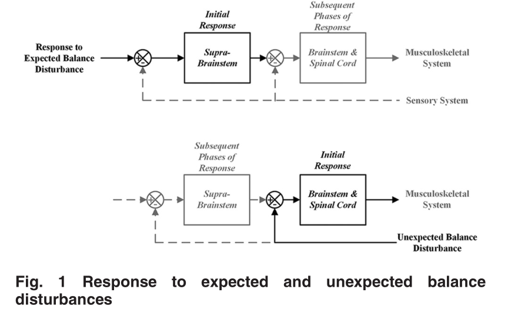

# Human balance and posture control during standing and walking (D A Winter 1998)

### 1 Inverted pendulum model (1D)

#### 1.1 Formula deviation 

$$
\alpha = \frac{\ddot{a}}{d}
\\ d\ distance\ between\ ankle\ joint\ and\ CoM\ position\ in\ horizontal\ direction
\\RP - Wg = I\alpha\\R:\ Ground reaction force\ W\ weight\\
RP - Wg = I\frac{\ddot{x}}{d}
\\W= R\\
W(P-g)=I\frac{\ddot{x}}{d}
\\P-g = I\frac{\ddot{x}}{Wd} = K\ddot{x}\\
\\
COP_{net} = COP_l{\frac{R_{vl}}{R_{vl}+R_{Vr}}}+COP_r{\frac{R_{vr}}{R_{vl}+R_{VR}} }\    	 {1}
$$

$$

$$

#### 1.2 Thinking

+ **The difference between COP and COM is proportional to the horizontal acceleration of the COM**
+ **p-g can be thought to be the signal in the balance signal, and this can be replaced by horizontal acceleration of COM**  
+ not only for AP direction, but also can be applied to the M/L direction 
+ the balance control described above is a special case of a more general approach.

### 2. Inverted Pendulum Model (2D)

#### 2.1 Formula Deviation

**tips**: 

$COP_{net}$ in either direction is under the control of **tour time-varying variables**

$COP_l\ COP_r$ are controlled by ankle. Ankle plantar flexor for AP. Invertors and evertors for ML

$R_{vl}\ R_{vr}$ are the loading s under each foot , when expressed as a time-varying $R_{vl}\ +\ R_{vr}$
$$
COP_v= COP_{net}-COP_c\\
COP_c = COP_l*0.5 + COP_r*0.5
$$

**tips**: $COP_v$ is the contribution due to the loading/unloading of each limb 

$COP_c$ is totally dominated by ankle or ankle flexor muscles

  

#### 2.2 Thinking

+ Left and right foot could not symmetrical in unilateral pathologies (stroke,amputees),even in normals, there is a dominant limb control. 
+ Increasing $R_{vr}$ could be caused by increased right hip abductor muscle activity or left adductor muscle activity
+ $COP_{net}$ in **AP** direction,mostly contributed by $COP_l$ and $COP_r$,  in the other word, hip loading mechanism could contributed nothing to the $COP_{net}$ , hip loading\unloading had no effect on COP position changing in AP direction. while in the ML direction, dominated by a loading/unloading response.
+ $COP_l,\ COP_r$  were quite synchronized in AP, while were antiphase in ML.
+ So the dominant control in the ML direction is due to the load/unloading mechanism

### 3 Biomechanical Modeling

Four-torque motors that control the parallelogram defined by two ankles and hips 

**eg:** if want $COP_{net}$  move to the right, four ways can make it.**(ankle L evertors R invertors, Hip L abductors R adductors** **)** 

which cause $COP_{net}$ moves to the right.

Movable platform translating into left caused $COP_{net}\ and\ COM$ move to the right, so it need take COM recovery into left. So the above muscles could make $COP_{net}$ move further into right, and put COM into left.

### 4 Centre of pressure and COM analysis, quiet stance

+ sevro control signal was the difference between COP and COG
+ measurement of COP were path length and area, amplitude and higher frequency content( in the elderly) 

+ The magnitude and frequency is of importance in the interpretation of the balance control system
+ classical feedback control would described above inverted pendulum model as being a underdamped system. (formula)increased gain would not only increase the amplitude of the error signal but also frequency of the oscillations
+ 

lumbar muscle. Their feet were positioned so the medial edges were parallel and the heel-to-heel stance width was 11% body height

For instance, when standing in the frontal plane relative to the perturbations, the lateral muscle pairs (gluteus medius and external oblique) demonstrated greater anticipatory co-activation 

[Welcome to SENIAM](http://www.seniam.org/) sensor placement

# Kinematic and kinetic validity of the inverted pendulum model in quiet standing(William H. Gage∗, David A 2004)

## Useful knowledge 

### Methods of estimating whole-body center of mass (COM)

+ twice integrating horizontal ground reaction shear forces [1]; unfortunately  these shear forces are extremely small, and subject to low signal to noise  ratios. Any small bias in the shear force results in a drift in the estimated  COM position.
+ using two markers or a single rod positioned at approximately the level of  the pelvis.

+ whole body COM location using a high-resolution optoelectronic 3D camera system  (OPTOTRAK), developing a fourteen segment bilateral model of COM.

### CoP - CoM versus CoM acceleration

In the AP direction mean R-values was -0.954, and in the ML direction, mean R-value was -0.840;

CoM: segment versus whole body CoM

calculating the correlation between CoM of each segments and whole body CoM, the synchronization indicated the rationality in modeling postural sway as inverted pendlum.

. Furthermore, the horizontal COM movements in the AP and ML directions of the whole body and each body segment increased linearly in amplitude as the height above the ankle increased

These findings indicate that when the net orientation of the lower limb(ankle to the hip) (a combination of the leg segment and thigh segment orientations) is considered, the lower limb angle tracks the movement of the whole body COM quite closely, more closely than when the ankle angle alone is considered.

### cut-off frequency

Winter [15] examined the frequency content of body segment movement during  natural cadence walking, and found that the highest frequency was related to  foot movement, at 6 Hz. Thus, they suggested a filter cut-off frequency of 6 Hz  in the processing of kinematic data obtained during locomotion.

## Good sentences

+ modeling postural sway as an inverted pendulum assumes a rigid structure above the ankle
+ However, the body is a multi-linked segmented structure capable of moving at all  of the joints superior to the ankle.
+ Movements at joints other than ankles, specially the hips, has been demonstrated in response to an external perturbation, as well as unperturbed quiet standing.
+ The r2 value was calculated to demonstrate the **temporal synchronization** in the movements of individual segment COMs and whole body COM. (the correlation coefficient (r2) between the displacement of each segment COM  and the whole body COM was calculated)
+ the slope of the relationship between COM height and displacement, in the AP and  ML directions, and the associated linear regression correlation coefficient (r2)  were calculated to demonstrate the spatial synchronization between the movements  of the segment COMs and the whole body COM.

# Stiffness Control of balance during quiet standing and dual task in older adults: the mobilize boston study(Hyun Gu Kang 2010)

## Good sentences

+ Cognitive distractions that divert attentional resources seem to impair postural  control
+ Cognitive distractions may interfere with the control of standing posture by  competing for the same pool of neural resources. Attention, executive function,  and the prefrontal cortex have been implicated as possible resources that are  taxed
+ suggests the lack of these attentional or neuronal resources during dual task may lead to **inadequate or inappropriate** activation of postural musculature

# Anticipatory coadaptation of ankle stiffness and sensorimotor gain for standing  balance

Current theories emphasise the role of the motor cortex in the feedback  correction of unexpected perturbations.

the control of balance is delegated to supra-spinal structures, such as the  cortex, which may allow for a more **refined control** than the spinal cord

the difficulty with this approach is that the neural feedback of movement introduce delays.

## useful knowledge

background:

**扰动检测**

The shortest spinal delay after which a change in contraction can be observed  following a direct electrical stimulation of the sensory nerve (as in Fig 1) is  around 30 ms in young subjects [10,11]. However, after a perturbation of stance,  the earliest change in muscular contraction occurs with a longer delay of around  100 ms in young subjects [13,14]. In older subjects, this is further delayed by  10 to 30 ms [13,14]. The change in force due to this muscle contraction is only  observed after an additional 40 ms [15]. Responses involving the cortex have  even longer delays than spinal feedback [16]

It is well known from control theory that delays are critical when using sensory  feedback to counteract external perturbations [17]: thus, a system that is  stabilized by feedback control may become unstable simply if the control delay  increases. Faster contributions to balance may therefore be more effective than  cortical control, particularly when standing in challenging balance conditions,  or with age-related increases in neural delays

With aging, there is an increase in the Hreflex latency of the ankle muscle  soleus by 10 to 15% [10,11]. The response of ankle muscles to support surface  rotations and translations is delayed by up to 30%

**interesting tips**

A. Spinal feedback is probed by electrically stimulating the sensory fibres of a muscle and measuring the resulting change in muscle contraction, called the H-reflex

**140ms** should be taken for young subject in response to external perturabtion.

For constant ankle stiffness, with increasing delay the CoM excursions increase  (Fig 3K, full yellow line), whereas the CoP excursions slightly decrease

For a constant delay, the peak excursion of both the CoM and CoP decrease with  increasing ankle stiffness (Fig 3J).控制减弱，还是维持相同的状态 

+ for a given neural delay, it is advantageous to increase the mechanical time  constant to slow down body dynamics. Indeed, this decreases the amplification of  perturbations during the response delay. In the sagittal plane, this can be  achieved by stiffening the ankle ,accompanied with decreasing their sensorimotor gains to prevent over-compensation.+
+ Additionally, our results show that following an increase in feedback delay,  sensorimotor gains must be decreased+
+ We apply our method for determining critical feedback to this extended model  (see Methods), and we find that mechanical damping improves balance performance  (decrease in τbalance in Fig 6A and 6D) and requires a larger proportional gain  (Fig 6B and 6E), and a smaller derivative gain (Fig 6C and 6F). Our main result  is however not affected: both increased stiffness (Fig 6A–6C) and neural delay  (Fig 6D–6F) require a decrease in proportional and derivative gains
+ co-adaptation strategy enables a decrease in both the CoM and CoP excursions, by  respectively 3.6% and 5.3% (Table 1, Co-adaptation). It is thus an appropriate  strategy for improving immobility in challenging balance conditions（increasing stiffness and decrease gaim）
+ extending their finding to multi-joints. This suggests that further increases in the stiffness of leg muscles (through  co-contraction) may be a useful strategy to further decrease falling speed. This  would then require a decrease in sensorimotor gains.
+ Subjects may in principle adopt any of the gains within the stable region,  however in practice they adopt gains which lead to a fast compensation of  perturbations without overshoot

During this supra-spinal delay, the dynamics are determined only by the body  mechanics and the spinal control. A decrease in spinal gains (without a  corresponding increase in stiffness) causes the **CoM to fall faster and further**  during this delay period (as schematically exaggerated in Fig 4B).The effect is therefore to worsen the resulting initial conditions which the  supra-spinal control will have to deal with.（研究背景）

. A cortical control strategy would therefore not benefit from a decrease in spinal gains.

# The Difference Between Stiffness and Quasi-Stiffness in the Context of  Biomechanical Modeling

## 1. Tips

+ The quasi-stiffness and stiffness are distinct concepts in the context of powered joints, and are equivalent in the context of passive joints.
+ 不能因为此时关节扭矩和角度之间的斜率为0，判断此时足部刚度为0. 可能系统的平衡点随着关节角度一起变化，如果外力使得其偏离轨迹，就是产生关节刚度

# Multiple roles of active stiffness in upright balance and multidirectional sway

## good sentences

+ Postural stability can be enhanced by intersegmental feedback and synergies,  mediated both by biomechanical coupling and central control

+ For lateral sway, a given extent of medial-lateral shift can be achieved using  either the PD mode via ankle torques or using alternate loading-unloading (LU)  of the two legs via a hip mechanism

+ corrective torque in case of perturbation

+ The objective of the present study was to elucidate mechanisms of two-dimensional voluntary sway and balance without a perturbation

+ lateral stiffness at the ankle seemed has no effect on balacne 

  

# Modeling and control of anterior–posterior and medial–lateral sways in standing posture(待读)

## good sentences

+ The idea of modeling the human body from a biomechanical perspective dates back  more than a century, and has been studied intensively
+ The naturally evolved human postural control mechanism is very complex, involving interactions between body dynamics, musculoskeletal and neurosensory systems
+ double stance phase and sit to stand such balance mechanism are not exactly same with stance balancing,treatments of constrains in modeling should be similar in these cases.
+ The current investigation on modeling and control synthesis of 3D standing  dynamics focuses on specification of the postural geometry, identification of  all constraints imposed on postural movements, separation of free and  constrained dynamic modes, synthesis of a feedback control with guaranteed  stability
+ Having a closed chain of body segments pivoting at the ankles, the standing  posture can be viewed as a parallel robot and its kinematics can be obtained  using a modeling method in robotics

# All leg joints contribute to quiet human stance: A mechanical analysis（2009）

## summary

+ We can confirm the anti-phase fluctuations (at about 1 Hz) by the belonging  negative $\phi_{hip}\ and\  \phi_{ankle}$ correlation
+ we can give evidence of even stronger torque couplings between adjacent joints
+ New questions might be tackled by the use of such models for movement synthesis: which movement system parameters determine the coupling of mechanical DOFs, including muscle force generation, coupling duration, and decay times(生物力学模型的问题)
+ bi-articular muscles is the very mechanical structure to implement the mainly observed torque correlation between adjacent joints.
+ To conclude, quiet human stance is a dynamic multi-segment phenomenon through and through.

# Functional postural responses after perturbations in multiple directions in a  standing man: a principle of decoupled control

## Summary

+ This shows that CNS controls the recovery from the multiple direction  perturbations of moderate strength by decoupling the AP-ML postural space into  two orthogonal directions (AP and ML).
+ the method of calculating the Net joint moment was provided by main text mentioned in 2.4 part
+ following a perturbation delivered simultaneously in two planes, result from a  control strategy that transforms multivariable control problem into two  decoupled univariable problems（NJT (AP) and the ankle and hip sum NJT (ML).

Good Senteces

+ This shows that CNS controls the recovery from the multiple direction  perturbations of moderate strength by decoupling the AP-ML postural space into  two orthogonal directions (AP and ML).所以仅仅干涉髋关节似乎是合理的，不同方向的扰动可以看作是前后的和左右之间的耦合作用。

  

+ Perturbations were generated at the level of pelvis of a standing subject by  means of a two degrees of freedom (DOF) servo-controlled mechanical apparatus  named `multi-purpose rehabilitation framea (MRF).

+ The time instant of perturbation commencement was unknown to the subjects.

# An Engineering Model of Human Balance Control—Part I: Biomechanical Model

## Good sentences

+ most have employed simplified balance dynamics to study small perturbations in a  single plane for which the standing body can be represented by a linear,  two-dimensional, single link inverted pendulum rotating about the ankles,  controlled by a generic proportional–integral–derivative (PID) controller. While  such models convey overall movement mechanics, they are largely limited to  cause-and-effect behavior, and lack the complexity to accurately characterize  the integrated multisegmental motor control of functional human balance.

+ The first is to develop a control system model of balance that reflects its multidimensional, multisegmental nature, as well as its underlying neurophysiology.

+ **Neurophysiologically Inspired Model of Balance** 

  + The response to an expected balance disturbance, often referred to as an  **anticipatory postural adjustment (APA**), is initially mediated by suprabrainstem  (cortex, cerebellum, and basal ganglia) predictive and motor planning processes  (Fig. 1, top) in advance of the disturbance. Subsequent phases of the response  are then modulated by lower-level sensory feedback and reflexive processes  involving the brainstem and spinal cord.

  + Responses to unexpected balance disturbances are triggered by sensory  information indicating that the state of the body is shifting to an  out-of-balance (OoB) condition. The initial response is generated by the lower  level brain stem and spinal cord processes and subsequently modulated by the  higher level supra-brainstem processes.

    

+ brain employs a strategy predicted by optimal feedback control [43–45] when  controlling movement tasks.

  + Pai and Patton [52] extended this by proposing that maintenance of standing  balance is a function of both the CoM’s projected position and its projected  velocity with respect to the boundaries of the BoS, and derived a feasible CoM  position–velocity space within which balance can be maintained

# Stiffness Control of Balance in Quiet Standing(1998)

## Summary

+ The model assumes that muscles act as springs to cause the CoP to move in phase with CoM as the body sway about some desired position. In the sagittal plane, ankle plantarflexors mechanism. frontal plane, hip ab/adductors.
+ restoration torque is set by joint stiffness through appropriate muscle tune.
+ a stiffness control would act immediately as the joint angle changed, causing the cop move in the same direction as the com

# Show that subjects who start falling during gait can be uprighted by such feed-forward assistive forces

## Summary

+ Aside from muscle weakness, a key factor leading to falls is degraded balance  control capability
+ Humans rely on a fine interplay of strategies to maintain balance during  standing and during locomotion
+ Less is known on how balance-assisting control strategies should be designed such that they are cooperative and integrate well with human control actions
+ Two major points need to be considered during control design for a balance-assisting device: First, a cooperative robotic support system should not override human control, because the human would adapt to the robotic support and increasingly rely on it [17]. To avoid such maladaptation, a device should only assist as needed [17; 18], providing just the support necessary to fulfill a task, which in this case is to recover balance. Second, whenever two controllers generate input signals to a system in a closed-loop manner and simultaneously, missing coordination between them can compromise stability. Therefore, the robotic controller should be designed such that it does not work against human control actions.
+ control law can be implemented in a computationally efficient way when simplifying assumptions on the dynamics are made.
+ evaluate how humans interact with and perceive the assistance
+ Thereby, one goal could be to bring the body to a stable posture with zero linear and angular velocity. Another goal could be just to slow down the fall, such that the patient has more time to regain control, for example to bring the swing leg to the front after a stumble
+ A main advantage is that the criterion relies only on kinematics and does not require measurement of ground reaction forces (**XCoM**)
