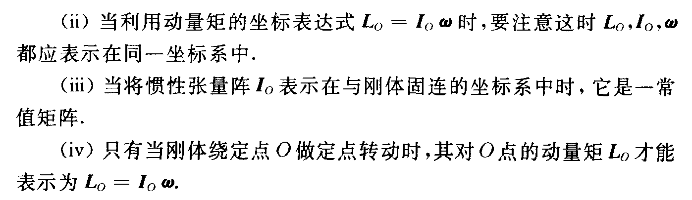
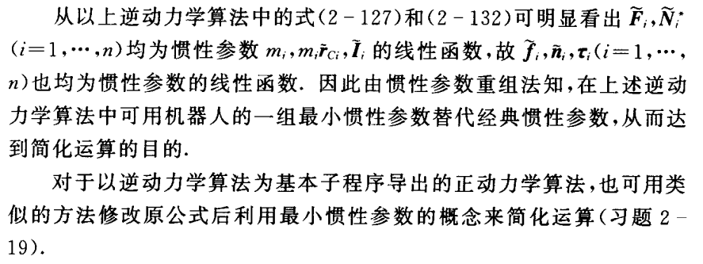
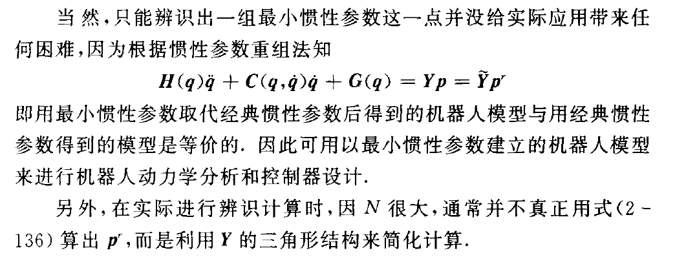

# Robot_Kinetic

## 1 Lagrange 方程建立自由运动的动力学方程 

### 1.1预备知识

限于研究质点系或者刚体系的运动微分方程

#### 1.1.1 广义坐标

**定义：** 确定系统位置且彼此独立的一组位置参数，系统广义坐标称之为系统的自由度 


#### 1.1.2 虚位移

**定义：** 为在约束条件下 广义坐标$q_j$ 的无限小位移。本质上是几何概念，与作用在质点上的力、时间、质点的运动微分方程均无关系，只是在几何上描述质点运动的可能性。

#### 1.1.3 理想约束

**定义：**约束施加给物体的力叫约束反力，物体受到约束反力之外的力称之为主动力。

若一约束使得系统的任何虚位移中，约束反力的元功之和为0，即满足下式，这种约束方式称之为理想约束


其中$N_i$ 为此约束给质点$i$的约束反力

**Tips:** 内部括号是所有约束反力及矢径对某个广义坐标的求导 × 某个坐标的虚位移

#### 1.1.4 虚功和广义力

**定义：** 作用在系统上的力在虚位移上所做的元功


**tips:** 其本质是每个质点所受的力 × 该质点位移对于广义坐标$q_j $ 的求导， 再将所有力相加

这个是所有外力对于某一个坐标的广义力

**几点注意：**

+ 广义力不是矢量，不一定具有力的量纲
+ $F_i$ 不仅包括主动力，也包括约束反力，只有在理想约束的情况下，$F_i$ 才可以看作是主动力
+ 方法是：使系统仅有一个虚位移$\delta q_j$ ,而保持其他广义坐标不变，计算此时的虚功 $\delta W = \sum_{k=1}^{N}Q_k\delta q_k = Q_j\delta_j$ 


#### 1.1.5 保守力的广义力


#### 1.1.6 第二类Lagrange 方程 


$L = T -V$ 

其中Q为非保守主动力系对应的广义力

**Tips:** 建立第二类Lagrange方程时，只需要用广义坐标将系统的动能 $T$ 和势能 $ V$ 表示出来, 并求出非保守的主动力的广义zhi力即可；

上述方程中的广义力只是主动力系的广义力，而约束反力并不存在。这使得其用来表示理想约束系统的动力学方程十分简洁


### 1.2 用Lagrange 方程建立自由运动机器人动力学方程

#### 1.2.1 广义坐标的选取和广义力的计算

通常选取$q = [q_1,q_2,....,q_n]^T$ 为机器人的广义坐标

$\tau_j$为作动器沿关节$j$轴向所施加的力，$Q_j = \tau_j$

#### 1.2.2 机器人动能和势能的计算


##### **动能**

记杆$i$ 中任意一个元质点在系$i$中的齐次坐标表达为 $^ir=[^ix,^iy,^iz,1]$ ,其在系0中的坐标表达为 


该点的齐次坐标表达为 


**tips:** 元质点在系i中的坐标表达与时间无关

故该**元质点的动能**表达如下：


由此可知杆$i$ 的动能


现在上式中的$J_i$


2-20式与力学中**质心，转动惯量以及惯性积**定义相同，主要用来刻画质量分布，如下


带入2-20


下面是化简和统一

易验证


**Tips:** $H(q)=h[ij]$常称为机器人的惯性矩阵，也是**对称的正定矩阵**


##### 势能

记杆$i$质心的齐次坐标在系$i$ 中的齐次坐标表达式为$^ir_{Ci}$ ,则其在系0下的坐标表达 $r_{Ci}=^0A_i*^ir_{Ci}$ ,故杆的势能如下


#### 1.2.3 利用第二类lagrange方程建立机器人动力学模型


**疑问**：2-27如何得到


**重要性质**反对称矩阵


#### 核心公式


``

```matlab
function [H,C,G] = LagrangianDynamics(dh_list, mass_list, mass_center_list, inertia_tensor_list)

[rows, columns] = size(dh_list);
number_of_links = rows;
if columns ~= 4
    error('wrong DH parameters!')
end

for i = 1:rows
    % 定义关节位置，速度，加速度符号
    eval(['syms ','q',num2str(i),' real;']);
    eval(['syms ','dq',num2str(i),' real;']);
    eval(['syms ','ddq',num2str(i),' real;']);
    eval(['q(i)=','q',num2str(i),';']);
    eval(['dq(i)=','dq',num2str(i),';']);
    eval(['ddq(i)=','ddq',num2str(i),';']);
end

A = sym([]);
for i = 1:number_of_links
    dh = dh_list(i,:);
    alpha(i) = dh(1);
    a(i) = dh(2);
    d(i) = dh(3);
    q(i) = dh(4);
    A(:,:,i) = [cos(q(i)),   -sin(q(i))*cos(alpha(i)),  sin(alpha(i))*sin(q(i)),  a(i)*cos(q(i));
                sin(q(i)), cos(q(i))*cos(alpha(i)), -sin(alpha(i))*cos(q(i)), a(i)*sin(q(i));
                0,           sin(alpha(i)), cos(alpha(i)),  d(i);
                0,                       0,                       0,              1];
end
A = simplify(A);

% 计算每个连杆坐标系在{0}系下的表达
A0 = sym([]);
for i = 1:number_of_links
    A0(:,:,i) = eye(4,4);
    for j = 1:i
        A0(:,:,i) = A0(:,:,i)*A(:,:,j);
    end
end
A0 = simplify(A0);

J = sym([]);
for i = 1:number_of_links
    J(:,:,i) = JMatrix(mass_list(i),mass_center_list(1,:),inertia_tensor_list(:,:,i));
end

% 计算H(q),由H(q)对称性，只需计算上三角部分
syms tr
for i = 1:number_of_links
    for j = i:number_of_links
        tr = 0;
        for k = j:number_of_links
            tr = tr + trace(eval(['diff(A0(:,:,k),q',num2str(i),')'])*J(:,:,k)*...
                eval(['diff(transpose(A0(:,:,k)),q',num2str(j),')']));
        end
        H(i,j) = simplify(tr);
        H(j,i) = H(i,j);
    end
end

% 计算C(q)
for i = 1:number_of_links
    for j = 1:number_of_links
        c = 0;
        for k = 1:number_of_links
            c = c + 1/2*(eval(['diff(H(i,j),q',num2str(k),')'])...
                        + eval(['diff(H(i,k),q',num2str(j),')'])...
                        - eval(['diff(H(j,k),q',num2str(i),')']))*eval(['dq',num2str(k)]);
        end
        C(i,j) = simplify(c);
    end
end

syms gc
g = [0,0,-gc,0]';

% 计算G(q)
for i = 1:number_of_links
    gi = 0;
    for j = 1:number_of_links
        gi = gi - mass_list(j)*g'...
                *eval(['diff(A0(:,:,j),q',num2str(i),')'])...
                *[mass_center_list(j,:),1]';
    end
    G(i) = simplify(gi);
end
G = G';

end
% 拉格朗日动力学方程求解测试
clc;
clear;
syms q1 q2 q3 m1 m2 m3 d2 real
syms Ix1 Iy1 Iz1 Ixy1 Iyz1 Ixz1 real
syms Ix2 Iy2 Iz2 Ixy2 Iyz2 Ixz2 real
syms Ix3 Iy3 Iz3 Ixy3 Iyz3 Ixz3 real
syms xc1 yc1 zc1 xc2 yc2 zc2 xc3 yc3 zc3 real

dh_params = [-pi/2, 0,  0, q1; 
             pi/2, 0, d2, q2;
             0, 0, 0, q3];
mass_center = [xc1, yc1, zc1; 
               xc2, yc2, zc2;
               xc3, yc3, zc3];
mass = [m1,m2,m3];
inertia_1 = [Ix1,  Ixy1, Ixz1;
             Ixy1, Iy1,  Iyz1;
             Ixz1, Iyz1, Iz1];
inertia_2 = [Ix2,  Ixy2, Ixz2;
             Ixy2, Iy2,  Iyz2;
             Ixz2, Iyz2, Iz2];
inertia_3 = [Ix3,  Ixy3, Ixz3;
             Ixy3, Iy3,  Iyz3;
             Ixz3, Iyz3, Iz3];
         
inertia_tensor(:,:,1) = inertia_1;
inertia_tensor(:,:,2) = inertia_2;
inertia_tensor(:,:,3) = inertia_3;

[h,c,g] = LagrangianDynamics(dh_params, mass, mass_center, inertia_tensor)
```


## 2 用牛顿欧拉公式建立自由运动机器人的动力学方程

### 2.1预备知识

#### 2.1.1 Newton 方程 

##### 质点的牛顿方程


##### 平动刚体的牛顿方程


**$\ddot r$  是刚体中每一点的加速度**

##### 一般运动刚体的牛顿方程 


**$\ddot r$  是刚体中质心的加速度**

#### 2.1.2 Euler 方程

##### 动量矩定理

+ 质点的动量矩定理

**动量矩定义**


**定理定义**


+ 刚体的动量矩


+ 刚体对任意点的动量矩定理 

  

  

  刚体相对于质心的动量矩定理：刚体对其质心相对动量矩的导数等于作为在刚体系上对质心的主矩

  

  ##### 刚体动量矩的坐标表达式

  1. ##### **刚体绕定点转动时动量矩的坐标表达式**

  推导过程

  

  

  

  

  对于惯性张量阵的几点说明

+ 

+ 


##### 刚体对质心动量矩的坐标表达式


##### 变矢量的绝对导数与相对导数定理 


##### euler 方程 

所谓的欧拉方程就是用变矢量的绝对导数和相对导数定理把动量矩定理表示在动坐标系（通常是与刚体固连的坐标系）

###### 绕定点转动


###### 做一般运动刚体对质心的Euler方程


### 

### 2.2 newton-euler 方程建立自由运动机器人的动力学方程

#### 2.2.1 机器人各杆受力分析如图


#### 2.2.2 建立动力学方程


**与Lagrange方程导出的最大区别是**  ：引入了约束反力

**优点：** 

+ 建立方程容易无需求解系统动能势能
+ 具有一定传递形式，减少了计算量

**Tips:** 上述方程均是在同一坐标系进行，为确定起见可以认为他们都是在杆0(基地下进行的)


## 3.自由运动 逆动力学 算法

### 3.1 概述

正运动学：已知关节扭矩，关节角度，速度，求解此时的关节加速度

逆运动学 ：已知关节角度，速度，角加速度，求解此时关节扭矩 

### 3.2 lagrange推导机器人动力学方程 


**计算框图**


### 3.3 用牛顿-欧拉方程推导自由运动机器人的逆动力学算法

#### 3.3.1 将牛顿欧拉方程写成递推形式


#### 3.3.2杆i的质心加速度计算


#### 3.3.3 重力项计算的简化


## 4机器人正运动学 算法

### 4.1 以逆动力学算法为基础的正动力学算法

#### 4.1.1基本原理


**tips: ** 在逆动力学算法中，另$\ddot q$ 等于0，这样求得$\tau = C(q,\dot q)\dot q +G(q)=b$  从而在利用已知$\tau -b$ 得到$\tau^*$ 

所以总的求解思路是令$\dot q=0,g=0,\ddot q = e_j(e_j是R^n的单位矢量)$ 这时计算出的$\tau$ 为H(q)的第j列

#### 4.2.2 组合体惯量法

令$\dot q=0,g=0,\ddot q = e_j(e_j是R^n的单位矢量)$ 这时计算出的$\tau$ 为H(q)的第$j$列 

此时对于$i>j$ ,$\dot q_i = \ddot q_i=0$  即杆j到杆n之间无相对运动 ，**称之为组合体**

对于i<j,，$\dot q_i = \ddot q_i=0$  即杆j到基座之间无相对运动，**称之为新基座**


 


#### 4.2.3 计算组合体质量、质心位置和对其质心惯性张量阵的递推公式


#### 4.2.4 利用正动力学算法进行机器人模拟 


## 5 机器人最小惯性参数及其应用

### 5.1机器人动力学 特性 于其惯性 参数间的线性关系

机器人杆$i$的动能 


任意矢量$a,b,c,d$ 均满足下式


### 5.2 惯性参数重组法与机器人的最小惯性参数


**两种情况**


余下的参数称之为recoupled inertial paprameters 重组惯性参数 或者是 classical inertial parameters.minimum inertial parameters 最小惯性参数，base parameters

**Tips**


### 5.3 最小惯性参数的应用

#### 5.3.1 用最小惯性参数简化机器人动力学计算



#### 5.3.2 将最小惯性参数的概念用于机器人的惯性参数辨识


但是并不能直接运用最小二乘 ，因为 **Y** 并不满秩




##### 用修改的DH参数直接确定机器人的最小惯性参数

其具体思路如下

首先是判断关节i 的性质（p98-99）

根据关节i 的性质确定 杆件i 的最小惯性参数特点

接着靠近末端关节开始计算连杆i 的惯性参数

Tips : 首先应该根据将基于质心坐标系的惯性参数转化为连杆坐标系 xx-> XX（p121）


这样可以求得上式子$CP = P_r$ 中的C 通过试凑
$$
\tau = Yp = Y_r p_r = Y_r(Cp)
\\ thus \   \ \ \ \ Y_r = C^{-1}*Y
$$
C 不是可逆矩阵 所以 可用伪逆  pinv 代替


