# 1 绪论

+ 黑箱到白箱

+ 现代控制理论：系统辨识，状态估计，控制理论

+ 80%的PID没有达到最优（缺乏系统辨识）

辨识参数 分为 **运动学参数** **动力学参数**

**运动学参数** ： 减速比 DH参数（通常其精度够用了，不需要辨识）

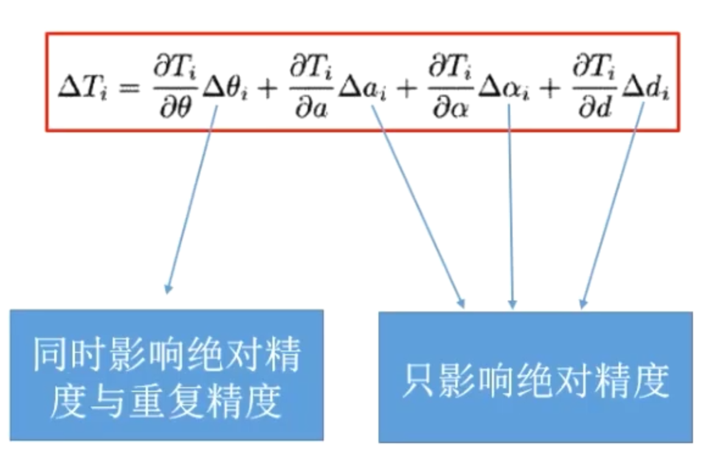

动力学参数： 最小惯性参数集
$$
\tau = Y_r p_r
$$
参数辨识方法：

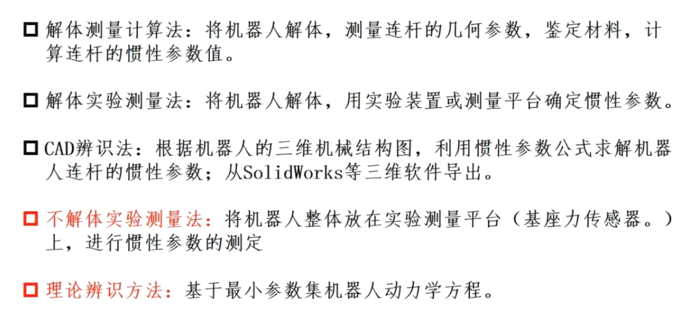

# 2 系统辨识基础

## 2.1 整体流程

$\tau = Y_r p_r$ 

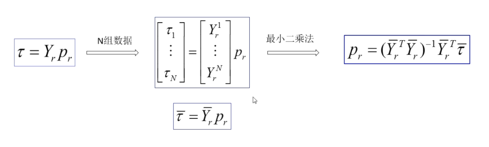

最小二乘具有很强的收敛性

## 2.2 相关细节

### 2.2.1 最小二乘

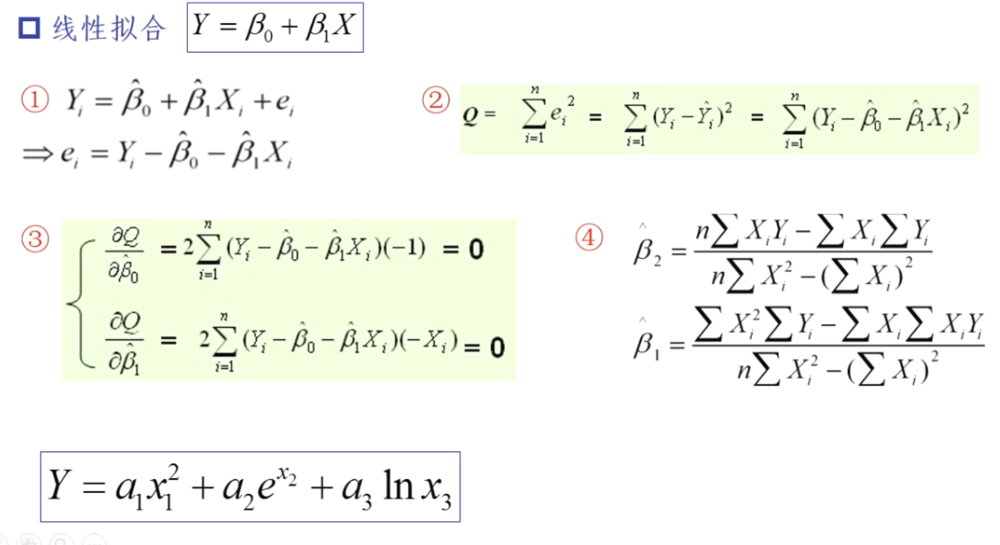

前提是高斯白噪声，才能确保是无偏估计

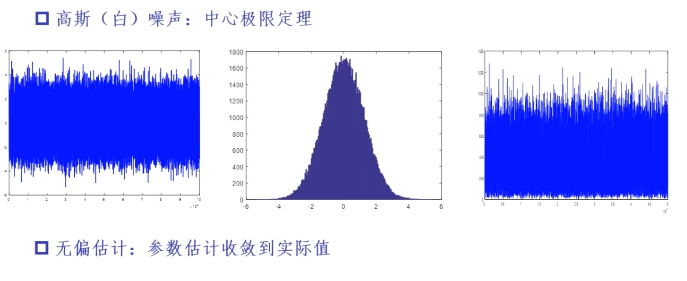

### 2.2.2 递推最小二乘，在线辨识减少运算量

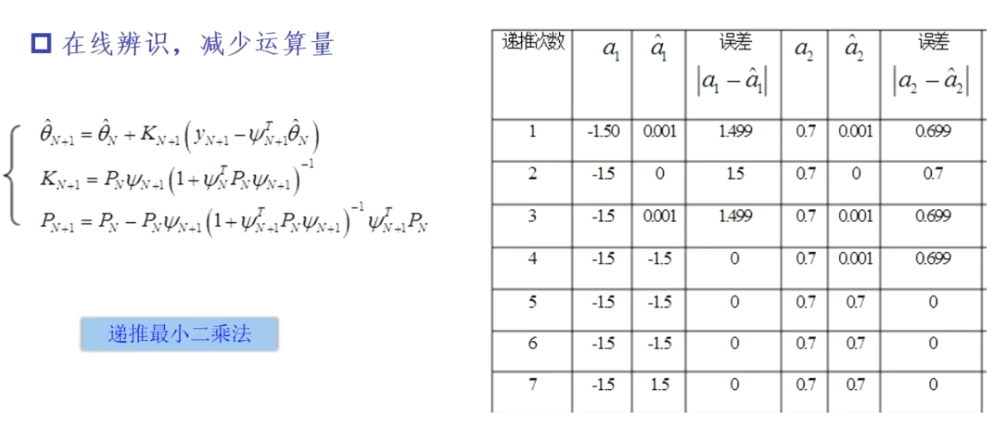

### 2.2.3 噪声影响

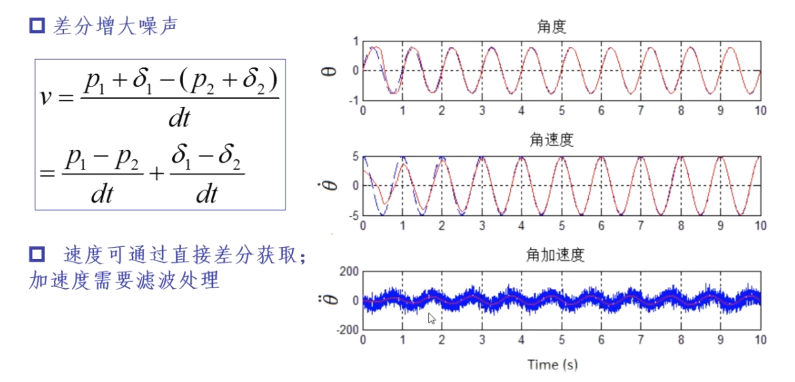

速度可以通过直接差分获取，加速度需要滤波处理

控制过程中避免角加速度的反馈

### 2.2.4 滤波器

低通滤波器

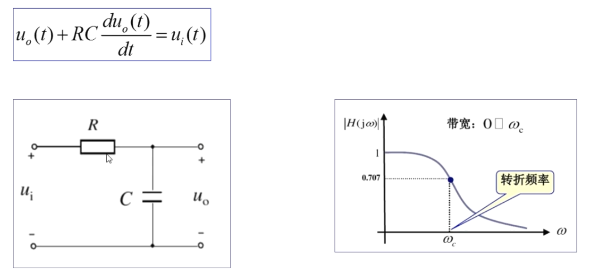 

电路就是模拟滤波器（改起来麻烦）

离散系统实现

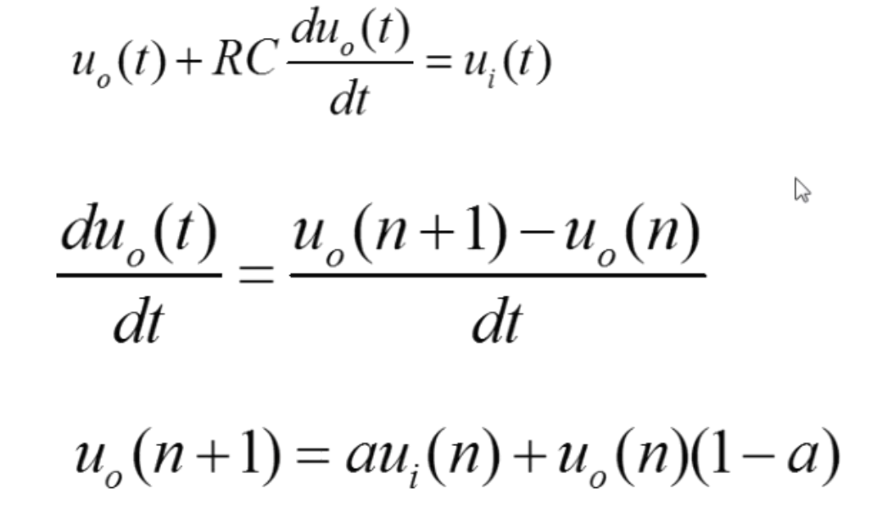

Tips: 滤波会必然引入延时，导致数据串掉，没法对其位移，速度，加速度的数据

### 2.2.5 离线滤波与在线并行滤波

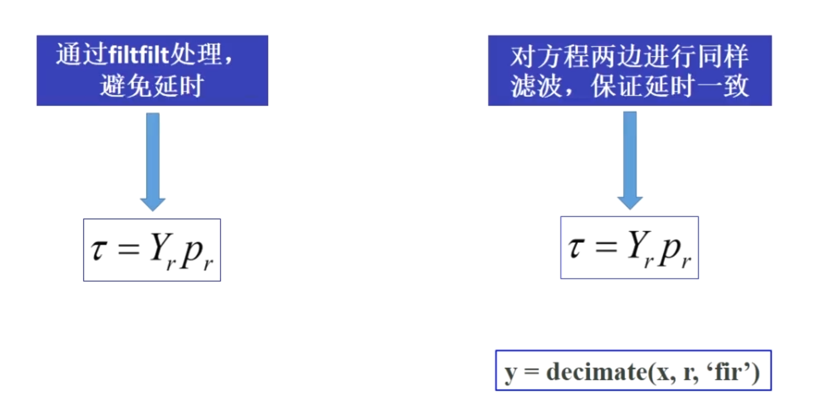

两种都是好方法，一般都是采集完所有数据在进行滤波进行辨识，所以可以用filtfilt函数进行辨识，消灭延时

或者在线辨识的话需要对等式两边同时滤波，这样也可以变相消除延时影响（decimate）

#### 在线并行滤波

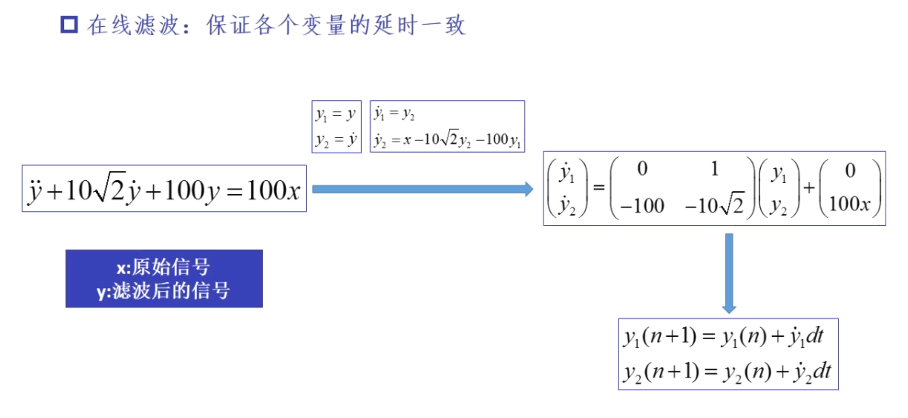

**力矩信号获取**

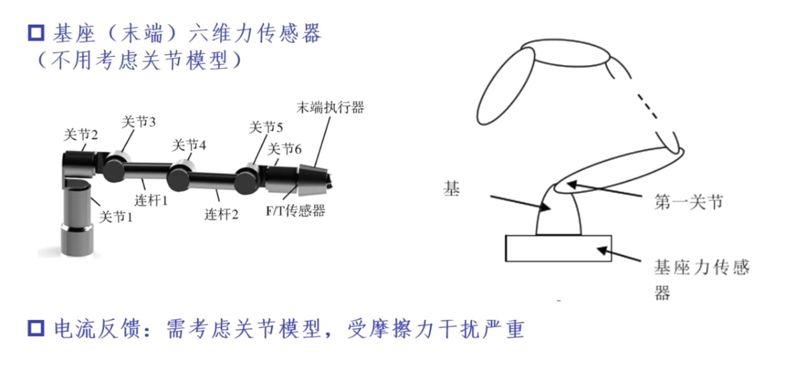

### 2.2.6 连续系统和离散系统

采样过程发生时：A/D 信号转化需要时间，信号在该时间段保持不变

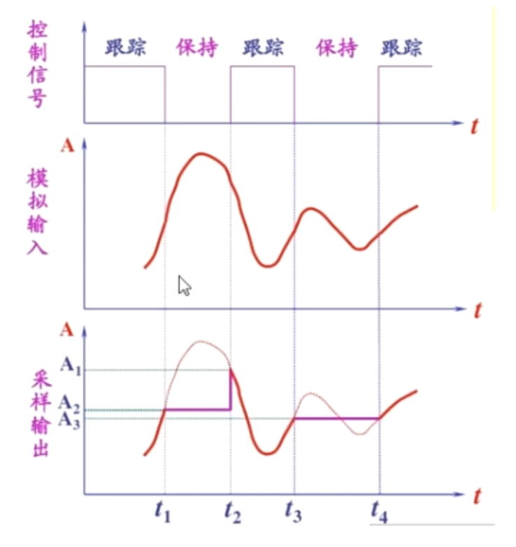

离散信号采样相较于连续信号（原始信号）会有ts/2的延迟，所以得使用奈奎斯特采样定理（2*fs）

eg: 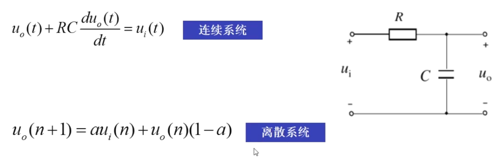

### 2.2.7 连续系统和离散系统的系统辨识

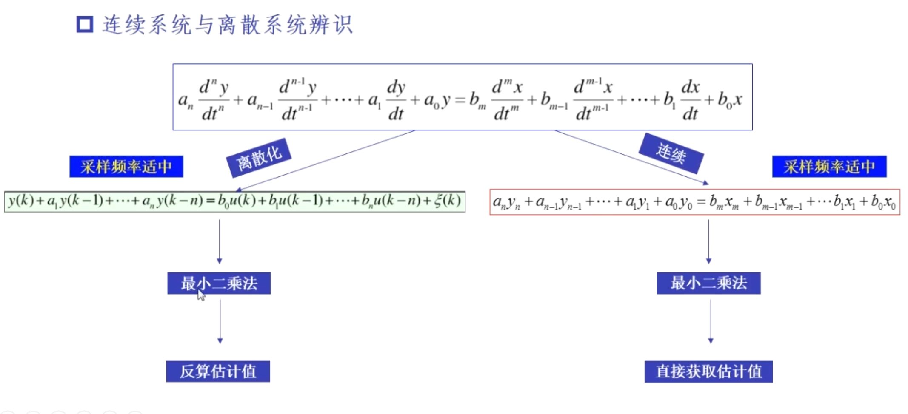

Tips：离散系统不需要速度，加速度量，只是需要位置参数，通过离散化，但是要注意dt其实包含在系数里

连续系统则是需要角速度和角加速度(推荐走连续)

 

### 2.2.8 最优激励轨迹

当解集x对A和b的系数高度敏感，那么这样的方程组就是病态的

eg: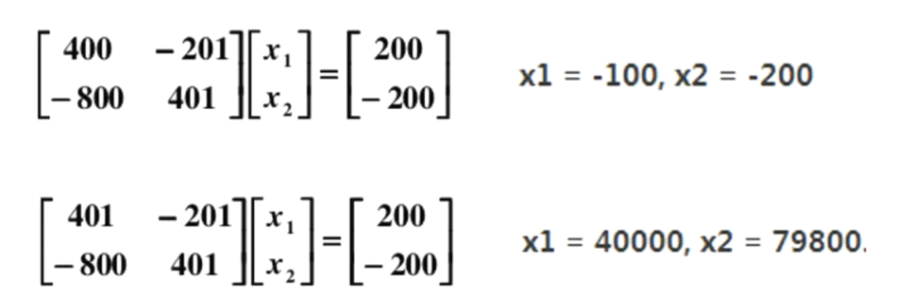.

评价指标: matlab conda

最优激励轨迹就是设计轨迹使得 $Y_r$ conda 最小

转化为优化问题，通过若干阶傅里叶级数生成轨迹，降低conda值

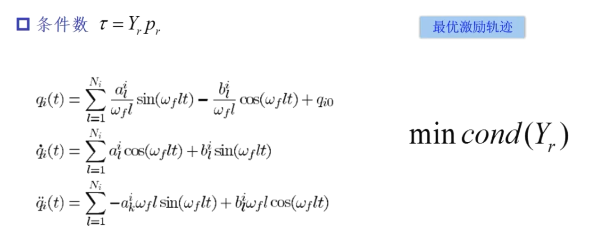

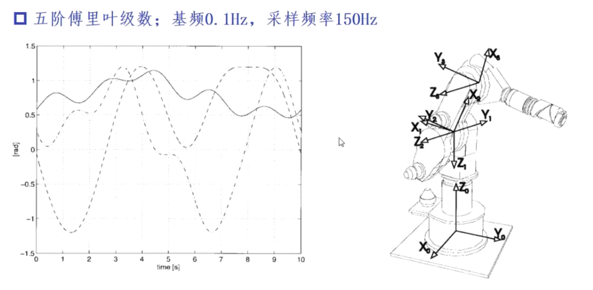

tips: 低速，避免激发关节柔性

其他理论系统辨识方法

先仿真后实践，慎重滤波，时刻提防摩擦力

# 3 实例 

单自由度连续系统辨识

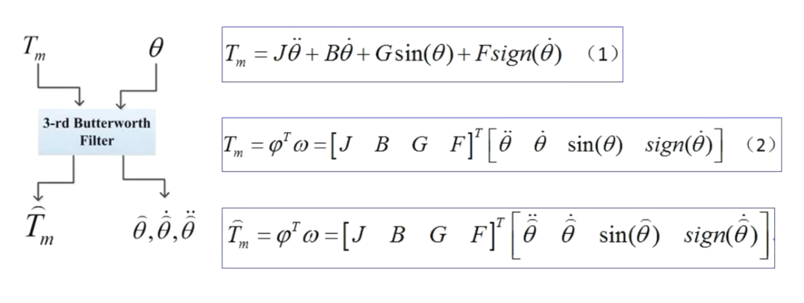

设置激励轨迹

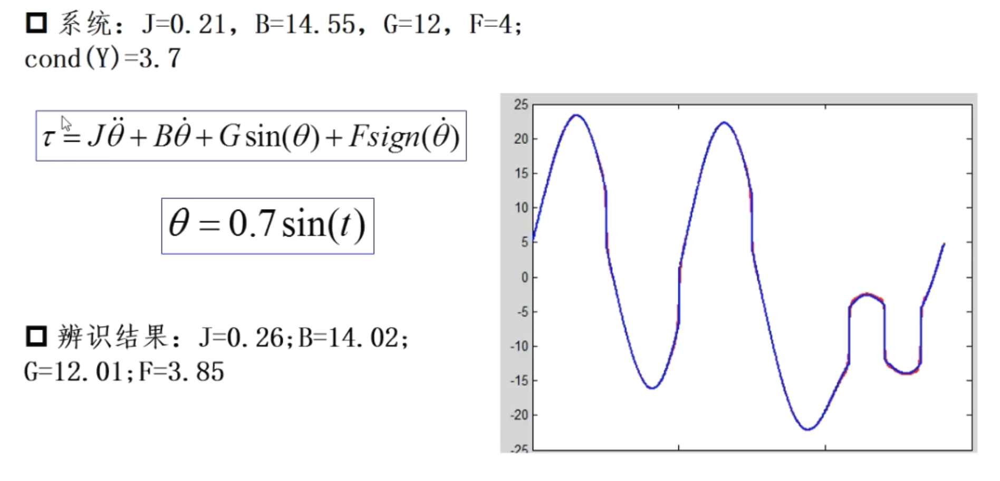

噪声影响（当某项所占比越小，该值估计越不稳定）

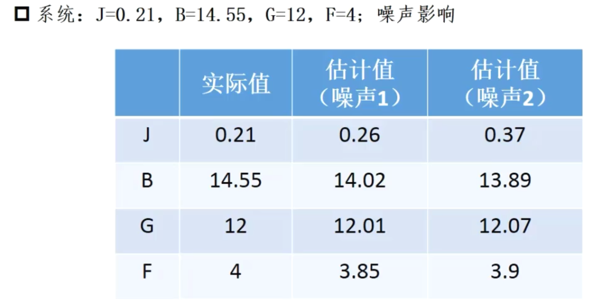

转速影响：会引起尖峰

8

单自由度离散系统辨识

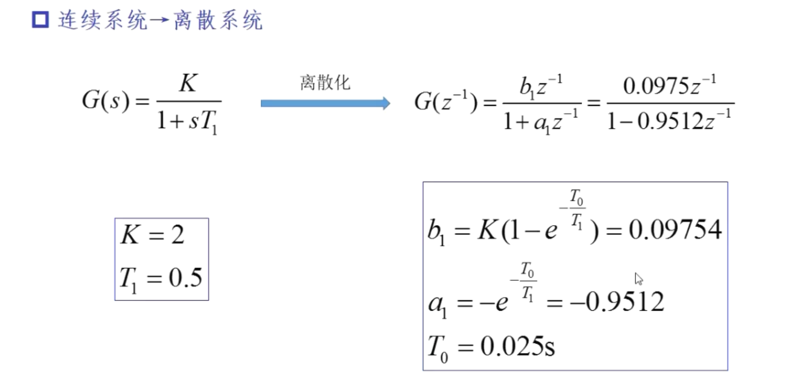