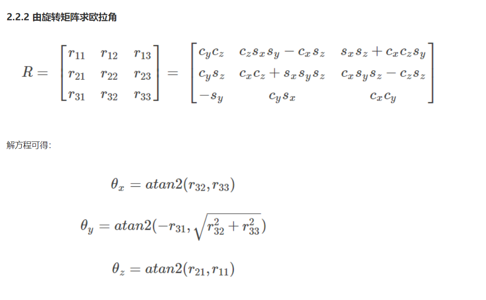

# 课程

# 作业（二连杆）

## 2 动力学建模

### 2.1 正向运动学

步骤：

+ 建立DH 参数表 
+ 依据DH 参数建立齐次变换矩阵
+ 依次相乘

Tips: 

例题：二连杆


```matlab
A_0_1 = [0 0 1 LWx;
         1 0 0 0;
         0 1 0 LWz;
         0 0 0 1];
A_1_2 = [cos(q1) -sin(q1) 0 L1*cos(q1);
         sin(q1) cos(q1) 0 L1*sin(q1);
         0 0 1 0;
         0 0 0 1];
A_2_3 = [cos(q2) -sin(q2) 0 L2*cos(q2);
         sin(q2) cos(q2) 0 L2*sin(q2);
         0 0 1 0;
         0 0 0 1];

An = A_0_1 * A_1_2 * A_2_3;
```

根据旋转变化矩阵求解欧拉角（固定轴）



### 2.2 求解雅可比矩阵

Tips : 两种方法 

+ **直接偏导** 机械臂末端至世界坐标系的齐次变化矩阵最后一列是 末端至世界坐标系原点的矢径在世界坐标系下的表达， 直接将其对广义坐标求$\theta_1, \theta_2$求 偏导， 各组成一列球的线速度，角速度则是上述齐次变化矩阵的第三列即z轴在世界坐标系下的投影
+ **几何法** 避免了求导，


​		该关节z轴在世界坐标系下的投影 叉乘 末端到关节处的矢径在世界坐标系下的表达， 可以迭代求解

```matlab
J =sym(zeros(6,2));

J(1:3,1) = cross(A_0_1(1:3,3),(An(1:3,4) - A_0_1(1:3,4)));
J(4:6,1) = A_0_1(1:3,3);

A_0_2 = A_0_1*A_1_2
J(1:3,2) = cross(A_0_2 (1:3,3),(An(1:3,4) - A_0_2(1:3,4)));
J(4:6,2) =A_0_2(1:3,3);
simplify(J)
```

2.3 动力学求解

